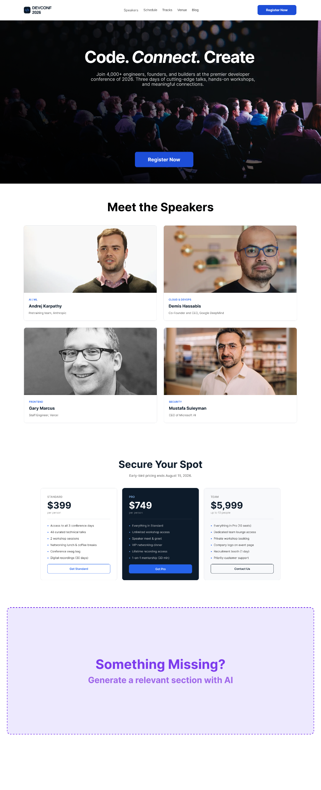

<!-- at, first. i gave this image to the ai(chtagpt) -->

<!-- then i gave this promt -->
its an image of full website page , i have created the other sections without the something missing section, you give me the code and tell what should i add in the something missing section and what should be accurate to creat in the section according to the website and cotext . 

<!-- then this promt -->
use only html and css 

<!-- then this promt -->
in css don't make it totally responsive,  i haven't learn that yet .  
<!-- after that i copied some code and pasted it in index.html file as your instructions says -
"Use AI (Claude, ChatGPT, or any tool) to help you ideate, design, and/or code this section."-->

<!-- after that i have to make some modification into the code given by ai(chatgpt) , because some classes were similar to my previous classes . -->